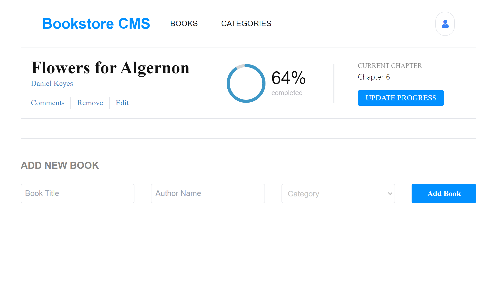

# Bookstore

> A website that allows you to display a list of books, add a new book or remove a selected book from the list.

## Screenshot

## Built With

### - Major languages
- React & Redux Toolkit
- Technologies used
  Webpack,Babel,Npm, Git

## Live Demo 

[Bookstore CMD](https://myelin0.github.io/Bookstore3/)

## Getting Started

To get a local copy up and running follow these simple example steps.

### Clone the repo [Bookstore](https://github.com/myelin0/Bookstore3) to your local computer 

### Install
run npm install on your terminal to install all the dependencies.
### Usage
run npm start to open the project in your local server

👤 **Emirjeta Veisllari**
- GitHub: [@myelin0](https://github.com/myelin0)
- Twitter: [@Amy_Albania](https://twitter.com/Amy_albania)
- LinkedIn: [@Emirjeta Veisllari](https://www.linkedin.com/in/emirjeta-veisllari/)

## 🤝 Contributing

Contributions, issues, and feature requests are welcome!

Feel free to check the [issues page](https://github.com/myelin0/Bookstore3/issues).

## Show your support

Give a ⭐️ if you like this project!

## Acknowledgments

- Hat tip to anyone whose code was used
- Inspiration
- etc

## 📝 License

This project is [MIT](./MIT.md) licensed.